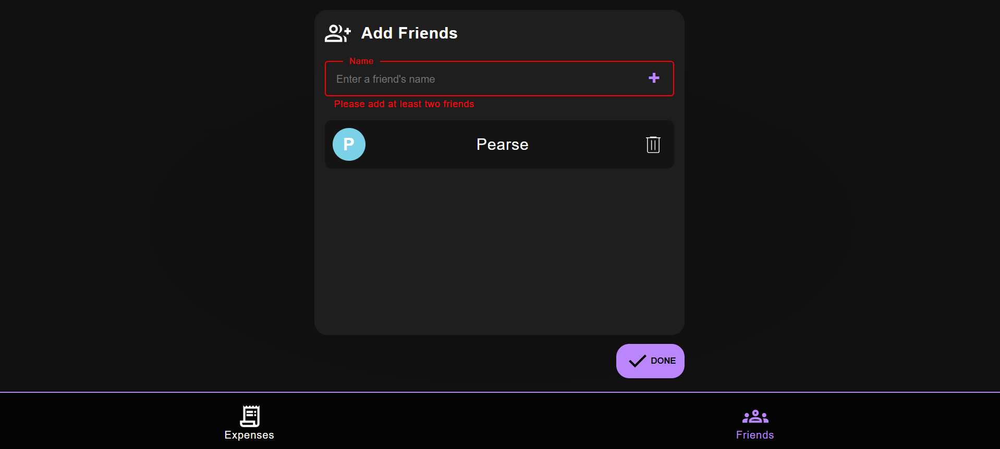
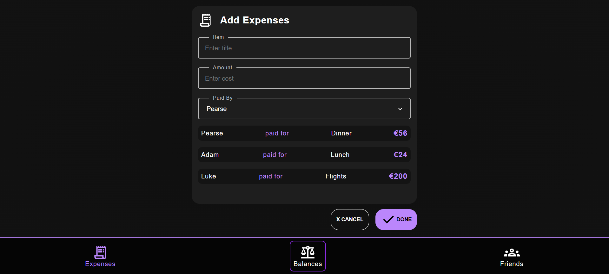
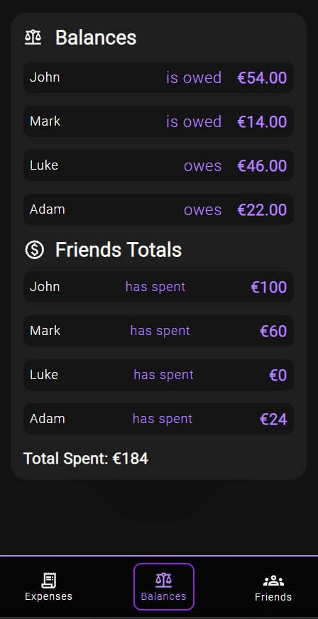

# TripSplit

TripSplit is a web application that helps you to split the expenses of a trip with your friends.

The user can add their friends into a group, add any expenses they might like to share among the group, who paid for each expense, and TripSplit will calculate how much each friend owes one another.

## [Link to Live site](https://pearsedarcy.github.io/tripsplit/)

## Project Goals

The primary goal of TripSplit is to develop a user-friendly web application that facilitates efficient management and equitable distribution of trip expenses among friends. By automating the process of expense tracking and splitting, TripSplit aims to enhance the overall travel experience and promote financial transparency and fairness within friend groups.

## User Stories

  - I want to take note off all the expenses of a trip with my friends.
  - I want to take note of who paid for what.
  - I want to seemlessly and automatically divide the costs between the group so that     everyone pays the same amount.

## Initial Design Considerations

### Figma Sketches

In the initial design phase, [Figma](https://figma.com) was utilized to create wireframes,  outlining the layout and structure of the web application. Adopting a mobile-first approach, the design prioritized usability and accessibility across various devices.

#### Mobile Page Structure

Using a mobile-first approach when beginning with this design was of great importance. 
Considering it would most likely be used while on holidays, it is safe to assume the majority of the users will be on mobile.

#### Desktop Page Structure

To simplify the build process, I used a scaled version of the mobile app for desktop and tablets, leading to a modern and intuitive look and feel.

## Design Language

I used Googles [M3 Material Design](https://m3.material.io/) as a basis for my design language.

### Color Choice

I used googles dark theme to choose the pallete for the app, using a gradient of greys for visual hierarcy and a purple to highlight important information.

### Fonts

The ubiquitous 'Roboto' font from Google was selected as the primary typeface for its versatility, readability, and widespread acceptance. Its balanced proportions and distinct characters contribute to a polished and professional aesthetic.

### Iconography

Icons sourced from [Google Fonts' Icon library](https://fonts.google.com/icons) were integrated into the design, leveraging SVG format to ensure responsiveness and flexibility. This decision not only enhances visual appeal but also optimizes performance across varying screen sizes and resolutions.

## Section Dissection

Here is a breakdown of each of the elements of the website.

### Welcome Page 

A welcome page was implemented to inform the user as to what the purpose of the web app was for. In testing, it was found that the simple introduction was sufficient to inform and prepare the user to be able to intuitivly navigate the application.

### Add Friends Page

When the user clicks get started they are presented with the 'Add Friends' page. This page contains an interactive form, that allows users to add a list of their friends to the group to share expenses with. 

#### Features

- Form shows errors if the user attempts fails to add at least two friends, or tries to submit an empty form.

- User is only allowed to add up to five friends to the group.

- When a user adds a friend, the app automatically generates a profile picture with a random color and the first letter of the friends name.

- The user can delete a friend from the list and will be prompted with a confirmation notification to confirm deletetion.

### Add Expenses Page

After the user has added at least two friends, the expenses navigation item pops up in the nav bar. When it is clicked, the user is presented with the add expenses form, where they can record any expense they would like to split between the group.

#### Features

- User can enter the name, cost and who paid for each expense.

- With every friend added or removed from the friends list, the name is added or removed from the paid by dropdown input.

- The form leverages window alerts to inform users if they attempt to submit an incomplete expense.

- Every expense is recorded and listed in the Expenses list below the form

### Balances Page

Once the user has added there first expense, the balance page navigation item appears in the navigation menu. When clicked, it displays the Balances page, which shows the automatically calculated Balance of which friends owes money, and which friends are owed money.

- Automatically calculates and displays the balance every time a new expense is added.

- Shows who owes money

- Shows who is owed money

- Shows if the balance is settled by equal expenditure

### Page Footer/Navigation

Using a mobile first approach, I placed the app navigation in the footer element, allowing the user to easily switch between sections. Each naviagtion item only appears as it is needed, allowing for intuitive use of the app withoutt the need for instructions. The users is unable to progress through the app unless they fill out the required information.

## Testing

Throughout the development of this project I continuously tested the website using the [W3C HTML Validator](https://validator.w3.org/nu/?doc=https%3A%2F%2Fpearsedarcy.github.io%2Ftripsplit%2F), The [JigSaw CSS Validator](https://jigsaw.w3.org/css-validator/validator?uri=https%3A%2F%2Fpearsedarcy.github.io%2Ftripsplit%2F&profile=css3svg&usermedium=all&warning=1&vextwarning=&lang=en), The [JSHint Validator](https://jshint.com/) and [Google Lighthouse](https://developer.chrome.com/docs/lighthouse). This enabled me to make sure that with every section that was added, the website was tested thoroughly for validity and use on all screens. Below are some screenshots of the final testing of the [deployed website](https://pearsedarcy.github.io/tripsplit/)

### Lighthouse Tests

##### Desktop

#### Mobile

#### W3C HTML Validator

#### Jigsaw CSS Validator

#### JSHint

### Links Testing

- I tested all links on the website to ensure they worked correctly.
- I tested all external links to ensure that they would open in a new tab.

### Form Testing

- I tested the form to confirm that it would not submit without validating the requirements, such as ensing all fields were filled out in the expense form before submission.

### Browser Testing

- I tested the website on a multitude of browsers to ensure cross-browser compatibility, such as Chrome, Firefox, Safari and Edge.

### Responsiveness Testing

- Using Chrome Dev tools, I tested the website to ensure that it scaled and squashed correctly in a variety of screen sizes and aspect ratios.
- I conducted a final test using [Responsinator](http://www.responsinator.com/?url=https%3A%2F%2Fpearsedarcy.github.io%2Ftripsplit%2F) to validate cross device compatibility.

### Bugs

I found several bugs throughout development, some of which were fixed, some of which have been left unresolved.

1. There is at times a rounding error that leaves the total amount owed off by two cent if the total amount is unevenly divided. This is due to the fact that the Javascript floor() method is always rounding down to the nearest integer. So when a number to be divided is recursive, i.e €3.33, the algorithm leads the a rounding error.

2. The application does not remove a users expense after they have been removed from the friends list. This is less of a bug and more of an unadded feauture due to time constraints.

## Deployment

The project was deployed using GitHub pages. The steps to deploy using GitHub pages are:

1. Navigate to the [repository](https://github.com/pearsedarcy/trisplt) on GitHub.com.
2. Click 'Settings' in the page header.
3. Click 'Pages' in the sidebar navigation.
4. Click the dropdown under the source heading and select the 'main' branch.
5. Click 'Save'.
6. You will receive a green confirmation banner confirming the site deployment and live link.

The Live Link to the website is available [here](https://pearsedarcy.github.io/tripsplit/)

## Credits

### Content

- I used the [Love Running Walkthrough Project](https://github.com/Code-Institute-Solutions/love-running-v3) from Code Institute as a guideline for building the Header and Footer.

- I referenced StackOverFlow, CodePen and MDN WebDocs throughout building the project to help with better understanding and implementing elements, sections and animations
  - [This](https://developer.mozilla.org/en-US/docs/Web/CSS/Layout_cookbook/Card) MDN Doc was great for the Cards section
  - [This](https://stackoverflow.com/questions/17296919/how-to-prevent-css3-animation-reset-when-finished) StackOverflow forum helped me with preventing the animations from looping.
  - [This](https://codepen.io/AdamCCFC/pen/WvzBKq) CodePen example helped me with the hover grow effect on the social media icons.

### Technologies Used

- **Languages**

  - HTML
  - CSS
  - Javascript

- **Development**

  - The website was built in [VS Code](https://code.visualstudio.com/).

- **Version Control**

  - The project was version controlled using [Git](https://git-scm.com/) and [GitHub](https://github.com).

- **Icons**

  - The icons for the website taken from [Google Fonts](https://fonts.google.com/icons)

- **Design**

  - The initial design was conceived in [Figma](https://figma.com).

- **Fonts**

  - The fonts were imported from [Google Fonts](https://fonts.google.com/)

#### Special Thanks

I would like to give a special thanks to my mentor Antonio Rodriquez who helped me throughout the development of this project.