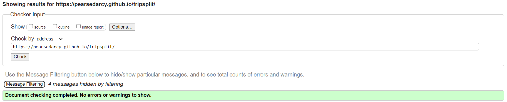
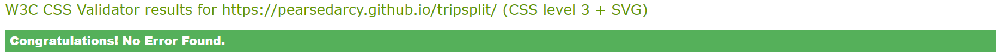

# TripSplit

TripSplit is a web application that helps you to split the expenses of a trip with your friends.

## [Link to Live site](https://pearsedarcy.github.io/tripsplit/)

## Project Goals

Build a web application that allows users record all the expenses of a trip, who paid for what, and then to automatically split the expenses between each friend.

## User Stories

  - I want to take note off all the expenses of a trip with my friends
  - I want to take note of who paid for what
  - I want to divide the costs between the group so that everyone pays the same amount

## Initial Design Considerations

### Figma Sketches

To design to basic layout and structure of the web app I built a basic design concept in [Figma](https://figma.com), a popular online design service.

#### Mobile Page Structure

Using a mobile-first approach when beginning with this design was of great importance. 
Considering it would most likely be used while on holidays, it is safe to assume the majority of the users will be on mobile.

#### Desktop Page Structure

To simplify the build process, I stuck to a scaled version of the mobile app for desktop and tablets. 

## Design Language

I used Googles [M3 Material Design](https://m3.material.io/) as a basis for my design language.

### Color Choice

I used googles dark theme to choose the pallete for the app, using a gradient of greys and a purple to highlight important information.

### Fonts

I used Google's popular 'Roboto' font as the typeface for this project.

### Iconography

The icons used on the website were taken from google fonts Icon library (link).
Rather than hyperlinking them I decided to insert them as SVG's for better responsiveness and flexibilty.

## Section Dissection

Here is a breakdown of each of the elements of the website.

### Page Footer/Navigation

Using a mobile first approach, I placed the app navigation in the footer element, allowing the user to easily switch between sections.

### Friends Section

The friends section consists of a form and a list

Errors

Interactivity

### Expenses Section

The expenses section consists of a form and a list

### Balances Section

Contains a list which displays totals and how much each friend owes or is owed

## Testing

Throughout the development of this project I continuously tested the website using the [W3C HTML Validator](https://validator.w3.org/nu/?doc=https%3A%2F%2Fpearsedarcy.github.io%2Fm-buildz%2F), The [JigSaw CSS Validator](https://jigsaw.w3.org/css-validator/validator?uri=https%3A%2F%2Fpearsedarcy.github.io%2Fm-buildz%2F&profile=css3svg&usermedium=all&warning=1&vextwarning=&lang=en), and [Google Lighthouse](https://developer.chrome.com/docs/lighthouse). This enabled me to make sure that with every section that was added, the website was tested thoroughly for validity and use on all screens. Below are some screenshots of the final testing of the [deployed website](https://pearsedarcy.github.io/tripsplit/)

### Lighthouse Tests

##### Desktop

#### Mobile

#### W3C HTML Validator

#### Jigsaw CSS Validator

### Links Testing

- I tested all links on the website to ensure they worked correctly.
- I tested all external links to ensure that they would open in a new tab.

### Form Testing

- I tested the form to confirm that it would not submit without validating the requirements, such as the correct email address structure.

### Browser Testing

- I tested the website on a multitude of browsers to ensure cross-browser compatibility, such as Chrome, Firefox, Safari and Edge.

### Responsiveness Testing

- Using Chrome Dev tools, I tested the website to ensure that it scaled and squashed correctly in a variety of screen sizes and aspect ratios.
- I conducted a final test using [Responsinator](http://www.responsinator.com/?url=https%3A%2F%2Fpearsedarcy.github.io%2Ftripsplit%2F) to validate cross device compatibility.

### Bugs

By using Google Lighthouse throughout the development, many bugs were discovered and squashed.

1. 

2. 
3. 

## Deployment

The project was deployed using GitHub pages. The steps to deploy using GitHub pages are:

1. Navigate to the [repository](https://github.com/pearsedarcy/trisplt) on GitHub.com.
2. Click 'Settings' in the page header.
3. Click 'Pages' in the sidebar navigation.
4. Click the dropdown under the source heading and select the 'main' branch.
5. Click 'Save'.
6. You will receive a green confirmation banner confirming the site deployment and live link.

The Live Link to the website is available [here](https://pearsedarcy.github.io/tripsplit/)

## Credits

### Content

- I used the [Love Running Walkthrough Project](https://github.com/Code-Institute-Solutions/love-running-v3) from Code Institute as a guideline for building the Header and Footer.

- I referenced StackOverFlow, CodePen and MDN WebDocs throughout building the project to help with better understanding and implementing elements, sections and animations
  - [This](https://developer.mozilla.org/en-US/docs/Web/CSS/Layout_cookbook/Card) MDN Doc was great for the Cards section
  - [This](https://stackoverflow.com/questions/17296919/how-to-prevent-css3-animation-reset-when-finished) StackOverflow forum helped me with preventing the animations from looping.
  - [This](https://codepen.io/AdamCCFC/pen/WvzBKq) CodePen example helped me with the hover grow effect on the social media icons.

### Technologies Used

- **Languages**

  - HTML
  - CSS
  - Javascript

- **Development**

  - The website was built in [VS Code](https://code.visualstudio.com/).

- **Version Control**

  - The project was version controlled using [Git](https://git-scm.com/) and [GitHub](https://github.com).

- **Icons**

  - The icons for the website taken from [Google Fonts](https://fonts.google.com/icons)

- **Design**

  - The initial design was conceived in [Figma](https://figma.com).

- **Fonts**

  - The fonts were imported from [Google Fonts](https://fonts.google.com/)

#### Special Thanks

I would like to give a special thanks to my mentor Antonio Rodriquez who helped me throughout the development of this project.